# Backend Architecture - UML Class Diagram

## System Overview

The backend is a C++-based drawing engine with WebAssembly compilation, providing high-performance shape management and real-time collaboration capabilities.

## UML Class Diagram

```mermaid
classDiagram
    %% Main Application Classes
    class Main {
        +main() int
        +testStrokeCreation() void
        +testStrokeErasing() void
        +testStrokeMoving() void
        +testClearing() void
        +testVertexBufferData() void
        +testShapeCreation() void
    }

    %% Core Drawing Engine Classes
    class DrawingEngine {
        -shapes: vector~unique_ptr~Shape~~
        +DrawingEngine() void
        +addShape(shape) void
        +addStroke(stroke) void
        +addPointToStroke(index, point) void
        +removeShape(index) void
        +removeStroke(index) void
        +moveShape(index, dx, dy) void
        +moveStroke(index, dx, dy) void
        +clear() void
        +getShapes() vector~unique_ptr~Shape~~&
        +getStrokes() vector~StrokeShape~
        +getVertexBufferData() vector~float~
    }

    %% Shape Hierarchy Classes
    class Shape {
        <<abstract>>
        +type: ShapeType
        +color: Color
        +thickness: float
        +Shape(type, color, thickness) void
        +~Shape() virtual
        +clone() unique_ptr~Shape~ virtual
    }

    class StrokeShape {
        +points: vector~Point~
        +StrokeShape(color, thickness, points) void
        +clone() unique_ptr~Shape~ override
        +getColor() Color&
        +getThickness() float
    }

    class RectangleShape {
        +topLeft: Point
        +bottomRight: Point
        +isFilled: bool
        +RectangleShape(color, thickness, topLeft, bottomRight) void
        +clone() unique_ptr~Shape~ override
    }

    class EllipseShape {
        +center: Point
        +radiusX: float
        +radiusY: float
        +isFilled: bool
        +EllipseShape(color, thickness, center, radiusX, radiusY) void
        +clone() unique_ptr~Shape~ override
    }

    class ShapeType {
        <<enumeration>>
        STROKE
        RECTANGLE
        ELLIPSE
    }

    %% Data Structure Classes
    class Point {
        +x: float
        +y: float
        +Point(x, y) void
        +Point() void
    }

    class Color {
        +r: float
        +g: float
        +b: float
        +a: float
        +Color(r, g, b, a) void
        +Color() void
    }

    class PointVector {
        +points: vector~Point~
        +size() size_t
        +capacity() size_t
        +empty() bool
        +push_back(point) void
        +get(index) Point&
    }

    class StrokeVector {
        +strokes: vector~StrokeShape~
        +size() size_t
        +capacity() size_t
        +empty() bool
        +push_back(stroke) void
        +get(index) StrokeShape&
    }

    %% WASM Binding Classes
    class Bindings {
        +EMSCRIPTEN_BINDINGS(drawing_module) void
        +bindColor() void
        +bindPoint() void
        +bindShapeType() void
        +bindStrokeShape() void
        +bindVectors() void
        +bindDrawingEngine() void
    }

    class DrawingEngineBinding {
        +DrawingEngine() constructor
        +addShape(shape) void
        +addStroke(stroke) void
        +addPointToStroke(index, point) void
        +removeShape(index) void
        +removeStroke(index) void
        +moveShape(index, dx, dy) void
        +moveStroke(index, dx, dy) void
        +clear() void
        +getStrokes() StrokeVector
        +getVertexBufferData() vector~float~
    }

    class ShapeBinding {
        +StrokeShape() constructor
        +points property
        +getColor() Color
        +getThickness() float
    }

    %% Vertex Buffer Classes
    class VertexBuffer {
        +data: vector~float~
        +vertexCount: size_t
        +stride: size_t
        +isDirty: bool
        +updateVertexData() void
        +getData() vector~float~&
        +getVertexCount() size_t
        +getStride() size_t
    }

    %% WebSocket Classes (if implemented)
    class WebSocketServer {
        +host: string
        +port: int
        +clientCount: int
        +isRunning: bool
        +start() void
        +stop() void
        +broadcast(message) void
        +handleMessage(clientId, message) void
    }

    class WebSocketMessage {
        +type: string
        +payload: string
        +clientId: string
        +timestamp: int64_t
        +WebSocketMessage(type, payload, clientId) void
        +serialize() string
        +deserialize(data) void
    }

    class MessageHandler {
        +handleStrokeStart(message) void
        +handleStrokePoint(message) void
        +handleStrokeFinish(message) void
        +handleStrokeAdd(message) void
        +broadcastToClients(message) void
    }

    %% Test Classes
    class TestFunction {
        +name: string
        +isPassed: bool
        +description: string
        +executionTime: int64_t
        +run() bool
        +validate() bool
        +logResult() void
    }

    %% Utility Classes
    class Draw {
        +drawStroke(ctx, stroke) void
        +drawRectangle(ctx, rect) void
        +drawEllipse(ctx, ellipse) void
        +calculateBoundingBox(points) Rectangle
    }

    class ColorImpl {
        +normalize() void
        +toRGBA() uint32_t
        +fromRGBA(rgba) void
        +blend(other, alpha) Color
    }

    %% Memory Management Classes
    class SmartPointer {
        +unique_ptr~T~
        +shared_ptr~T~
        +weak_ptr~T~
    }

    class MemoryPool {
        +allocate(size) void*
        +deallocate(ptr) void
        +getUsage() size_t
        +getCapacity() size_t
    }

    %% Performance Optimization Classes
    class SpatialIndex {
        +quadTree: QuadTree
        +rTree: RTree
        +insert(shape) void
        +query(bounds) vector~Shape*~
        +remove(shape) void
        +clear() void
    }

    class BatchProcessor {
        +operations: queue~Operation~
        +batchSize: size_t
        +addOperation(op) void
        +processBatch() void
        +flush() void
    }

    %% Relationships
    Main --> DrawingEngine : uses
    Main --> TestFunction : runs

    DrawingEngine --> Shape : manages
    Shape <|-- StrokeShape : specializes
    Shape <|-- RectangleShape : specializes
    Shape <|-- EllipseShape : specializes

    DrawingEngine --> VertexBuffer : generates
    DrawingEngine --> PointVector : uses
    DrawingEngine --> StrokeVector : uses

    StrokeShape --> Point : contains
    StrokeShape --> Color : has
    StrokeShape --> PointVector : uses

    RectangleShape --> Point : defines
    RectangleShape --> Color : has

    EllipseShape --> Point : defines
    EllipseShape --> Color : has

    PointVector --> Point : stores
    StrokeVector --> StrokeShape : stores

    Bindings --> DrawingEngineBinding : creates
    Bindings --> ShapeBinding : creates
    DrawingEngineBinding --> DrawingEngine : exposes

    VertexBuffer --> Point : processes
    VertexBuffer --> Color : processes

    WebSocketServer --> WebSocketMessage : handles
    WebSocketServer --> MessageHandler : uses
    MessageHandler --> DrawingEngine : updates

    TestFunction --> DrawingEngine : validates

    DrawingEngine --> Draw : uses
    Color --> ColorImpl : implements

    DrawingEngine --> SmartPointer : uses
    DrawingEngine --> MemoryPool : uses

    DrawingEngine --> SpatialIndex : uses
    DrawingEngine --> BatchProcessor : uses
```



## Key Features & Capabilities

### 1. **High Performance Shape Management**

- Efficient vector-based shape storage
- Polymorphic shape hierarchy
- Memory-optimized data structures

### 2. **WebAssembly Integration**

- Emscripten-based compilation
- Type-safe JavaScript bindings
- Zero-copy memory access

### 3. **Real-time Collaboration**

- WebSocket message handling
- Shape synchronization
- Multi-user support

### 4. **WebGPU Optimization**

- Vertex buffer generation
- Efficient rendering data
- GPU-friendly formats

### 5. **Extensible Architecture**

- Plugin-based shape system
- Modular design patterns
- Easy shape type addition

### 6. **Comprehensive Testing**

- Unit test coverage
- Performance benchmarking
- Memory leak detection

## File Structure

```
backend/
├── src/
│   ├── main.cpp                    # Application entry point
│   ├── bindings.cpp               # Emscripten bindings
│   └── implement/
│       ├── DrawingEngine/
│       │   ├── DrawingEngine.hpp  # Main engine interface
│       │   └── DrawingEngine.cpp  # Engine implementation
│       ├── shape.hpp              # Base shape class
│       ├── stroke_shape.hpp       # Stroke implementation
│       ├── rectangle_shape.hpp    # Rectangle implementation
│       ├── ellipse_shape.hpp      # Ellipse implementation
│       ├── color.hpp              # Color utilities
│       └── draw.hpp               # Drawing utilities
├── cpp_server/
│   ├── CMakeLists.txt            # Build configuration
│   └── src/
│       └── main.cpp              # Native C++ server
├── scripts/
│   ├── build.sh                  # Build automation
│   ├── build_wasm.sh            # WASM compilation
│   └── build_native.sh          # Native compilation
└── CMakeLists.txt               # Root build configuration
```

## Performance Characteristics

- **Memory Usage**: Efficient vector-based storage
- **Shape Operations**: O(1) average case for most operations
- **Vertex Generation**: Optimized for WebGPU rendering
- **WASM Size**: ~100KB compiled size
- **Rendering**: 60 FPS capable with thousands of shapes
- **Scalability**: Supports real-time multi-user collaboration

## Build System

### WASM Compilation

```bash
# Compile to WebAssembly
emcc src/main.cpp src/bindings.cpp \
     -I./src/implement \
     -s WASM=1 \
     -s EXPORTED_FUNCTIONS='["_main"]' \
     -s EXPORTED_RUNTIME_METHODS='["ccall","cwrap"]' \
     -O3 \
     -o public/drawing_engine.js
```

### Native Compilation

```bash
# Compile native binary
g++ -std=c++17 \
    -I./src/implement \
    src/main.cpp \
    src/implement/DrawingEngine/DrawingEngine.cpp \
    -O3 \
    -o drawing_engine
```

## Testing Strategy

### Unit Tests

- Shape creation and manipulation
- Memory management validation
- Performance benchmarking
- WASM binding verification

### Integration Tests

- Frontend-backend communication
- WebSocket message handling
- Real-time collaboration scenarios
- Cross-platform compatibility

### Performance Tests

- Large shape set handling
- Memory usage profiling
- Rendering performance metrics
- Network latency impact
