# Frontend Architecture - UML Class Diagram

## System Overview

The frontend is a React-based real-time collaborative whiteboard application with WebAssembly integration for high-performance drawing operations.

## UML Class Diagram

```mermaid
classDiagram
    %% Main Application Classes
    class App {
        +render() void
        +AppContent() React.FC
    }

    class WhiteboardProvider {
        -state: WhiteboardState
        -dispatch: Dispatch
        -toolManager: ToolManager
        -wasmEngine: DrawingEngineBridge
        +WhiteboardProvider(props) void
        +render() ReactNode
    }

    class WhiteboardContext {
        +createContext() Context
        +Provider: Provider
        +Consumer: Consumer
    }

    %% State Management Classes
    class WhiteboardState {
        +activeTool: DrawingTool
        +settings: ToolSettings
        +strokes: Stroke[]
        +currentStroke: Stroke
        +selectedStrokes: Set~number~
        +isWasmLoaded: boolean
        +wasmError: string
        +websocket: WebSocket
        +isConnected: boolean
        +userId: string
        +currentStrokeId: string
    }

    class WhiteboardReducer {
        +whiteboardReducer(state, action) WhiteboardState
        +SET_ACTIVE_TOOL(payload) void
        +UPDATE_SETTINGS(payload) void
        +SET_STROKES(payload) void
        +SET_CURRENT_STROKE(payload) void
        +TRIGGER_STROKE_UPDATE() void
    }

    %% UI Component Classes
    class Canvas {
        -canvasRef: RefObject
        -isDrawing: boolean
        -shapeStart: Point
        -previewShape: Stroke
        +handlePointerDown(event) void
        +handlePointerMove(event) void
        +handlePointerUp(event) void
        +render() ReactNode
    }

    class Toolbar {
        -tools: ToolConfig[]
        +handleToolSelect(toolType) void
        +handleColorChange(event) void
        +handleThicknessChange(event) void
        +render() ReactNode
    }

    class WebSocketStatus {
        +render() ReactNode
    }

    %% Tool System Classes
    class ToolManager {
        -tools: Map~ToolType, DrawingTool~
        -activeTool: ToolType
        -settings: ToolSettings
        +getActiveTool() DrawingTool
        +setActiveTool(toolType) void
        +getAllTools() DrawingTool[]
        +updateSettings(settings) void
        +getSettings() ToolSettings
    }

    class DrawingTool {
        <<interface>>
        +id: string
        +name: string
        +icon: string
        +cursor: string
        +isActive: boolean
        +color: Color
        +thickness: number
        +startDrawing(point) void
        +continueDrawing(point) void
        +finishDrawing() WASMShape
        +updateSettings(settings) void
    }

    class StrokeTool {
        -currentPoints: Point[]
        -isDrawing: boolean
        +startDrawing(point) void
        +continueDrawing(point) void
        +finishDrawing() WASMShape
    }

    class RectangleTool {
        +startDrawing(point) void
        +continueDrawing(point) void
        +finishDrawing() WASMShape
    }

    class EllipseTool {
        +startDrawing(point) void
        +continueDrawing(point) void
        +finishDrawing() WASMShape
    }

    class EraserTool {
        +eraseAtPoint(point) void
    }

    class SelectTool {
        +selectStrokes(indices) void
        +moveSelectedStrokes(dx, dy) void
    }

    %% WASM Integration Classes
    class useWASM {
        -isLoaded: boolean
        -error: string
        -drawingEngine: DrawingEngineBridge
        +useWASM() object
    }

    class DrawingEngineBridge {
        -module: unknown
        -engine: unknown
        -isLoaded: boolean
        +loadWASM() Promise~void~
        +isReady() boolean
        +addStroke(stroke) void
        +addPointToStroke(index, point) void
        +removeStroke(index) void
        +moveStroke(index, dx, dy) void
        +clear() void
        +getStrokes() WASMStroke[]
        +getVertexBufferData() number[]
        +addShape(shape) void
    }

    %% WebSocket Communication Classes
    class WebSocketClient {
        -connection: WebSocket
        -isConnected: boolean
        -url: string
        +connect() void
        +disconnect() void
        +send(message) void
        +onMessage(handler) void
    }

    class WebSocketMessage {
        +type: string
        +payload: object
        +userId: string
        +timestamp: number
    }

    %% Data Type Classes
    class Point {
        +x: number
        +y: number
    }

    class Color {
        +r: number
        +g: number
        +b: number
        +a: number
    }

    class Stroke {
        +points: Point[]
        +color: string
        +thickness: number
        +id: string
        +userId: string
        +timestamp: number
    }

    class ToolSettings {
        +color: Color
        +thickness: number
        +eraserSize: number
    }

    class WASMStroke {
        +points: Point[]
        +color: Color
        +thickness: number
    }

    class ToolType {
        <<enumeration>>
        STROKE
        RECTANGLE
        ELLIPSE
        ERASER
        SELECT
    }

    %% Utility Classes
    class DebugUtils {
        +logger: Logger
        +ToolDebugger: ToolDebugger
        +PerformanceTracker: PerformanceTracker
        +logDrawing(operation, data) void
        +logErasing(operation, data) void
    }

    class ColorUtils {
        +hexToRgb(hex) Color
        +rgbToHex(color) string
    }

    %% Relationships
    App --> WhiteboardProvider : uses
    WhiteboardProvider --> WhiteboardContext : provides
    WhiteboardProvider --> WhiteboardState : manages
    WhiteboardProvider --> WhiteboardReducer : uses
    WhiteboardProvider --> ToolManager : orchestrates
    WhiteboardProvider --> useWASM : integrates
    WhiteboardProvider --> WebSocketClient : communicates

    Canvas --> WhiteboardContext : consumes
    Toolbar --> WhiteboardContext : consumes
    WebSocketStatus --> WhiteboardContext : consumes

    ToolManager --> DrawingTool : manages
    DrawingTool <|-- StrokeTool : implements
    DrawingTool <|-- RectangleTool : implements
    DrawingTool <|-- EllipseTool : implements
    DrawingTool <|-- EraserTool : implements
    DrawingTool <|-- SelectTool : implements

    useWASM --> DrawingEngineBridge : uses
    DrawingEngineBridge --> WASMStroke : processes

    WebSocketClient --> WebSocketMessage : sends/receives
    WhiteboardProvider --> WebSocketMessage : handles

    WhiteboardState --> Stroke : stores
    WhiteboardState --> ToolSettings : contains
    WhiteboardState --> ToolType : uses

    Stroke --> Point : contains
    Stroke --> Color : uses
    ToolSettings --> Color : contains

    Canvas --> Point : creates
    Canvas --> Stroke : renders
    Toolbar --> ColorUtils : uses
    WhiteboardProvider --> DebugUtils : uses
```



## Key Features & Capabilities

### 1. **Real-time Collaboration**

- WebSocket-based point-by-point synchronization
- Live drawing preview across multiple users
- Automatic reconnection handling

### 2. **High Performance Drawing**

- WebAssembly integration for C++ drawing engine
- WebGPU vertex buffer optimization
- Efficient stroke management

### 3. **Modular Tool System**

- Polymorphic tool architecture
- Pluggable drawing tools (Stroke, Rectangle, Ellipse, Eraser, Select)
- Dynamic tool switching

### 4. **State Management**

- React Context for global state
- Reducer pattern for predictable state updates
- Optimistic UI updates

### 5. **Type Safety**

- Comprehensive TypeScript interfaces
- Shared type definitions across components
- Compile-time error checking

### 6. **Debug & Performance**

- Comprehensive logging system
- Performance tracking
- Development tools integration

## File Structure

```
frontend/src/
├── App.tsx                    # Main application component
├── components/
│   ├── Canvas.tsx            # Drawing canvas component
│   ├── Toolbar.tsx           # Tool selection interface
│   └── WebSocketStatus.tsx   # Connection status display
├── contexts/
│   ├── WhiteboardContext.tsx # Main state management
│   ├── ctx.ts               # Context creation
│   └── types.tsx            # Context type definitions
├── hooks/
│   ├── useWasm.ts           # WASM integration hook
│   ├── useWebGPU.ts         # WebGPU rendering hook
│   └── useWhiteBoard.ts     # Whiteboard operations hook
├── tools/
│   ├── ToolManager.ts       # Tool orchestration
│   ├── StrokeTool.ts        # Pen tool implementation
│   ├── RectangleTool.ts     # Rectangle tool
│   ├── EllipseTool.ts       # Ellipse tool
│   ├── EraserTool.ts        # Eraser tool
│   └── SelectTool.ts        # Selection tool
├── types/
│   ├── tool.ts              # Tool type definitions
│   ├── wasm.ts              # WASM interface types
│   └── webgpu.ts            # WebGPU type definitions
├── utils/
│   └── debug.ts             # Debugging utilities
└── wasm/
    └── drawingEngine.ts     # WASM bridge implementation
```

## Performance Characteristics

- **Rendering**: 60 FPS canvas updates
- **Memory**: Efficient stroke storage with WASM
- **Network**: Real-time WebSocket communication
- **Scalability**: Supports multiple concurrent users
- **Responsiveness**: Immediate UI feedback
