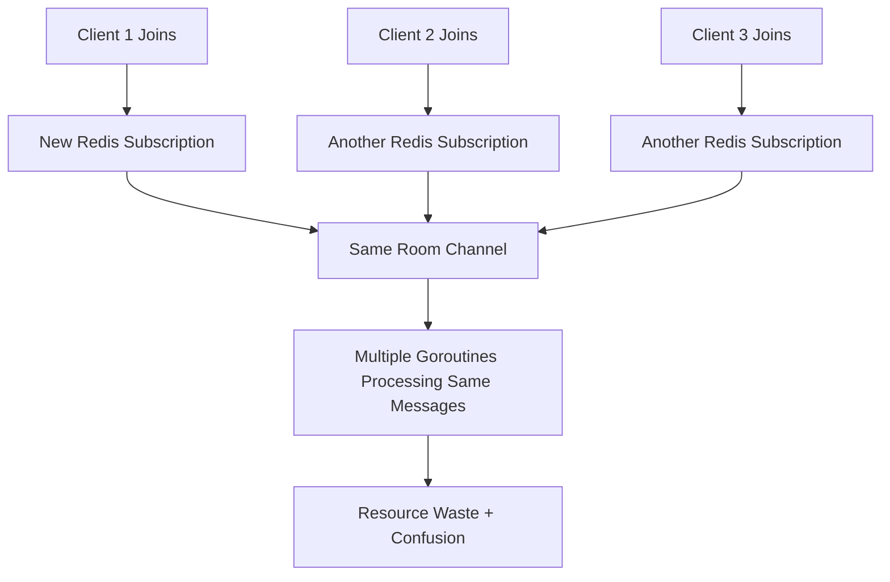
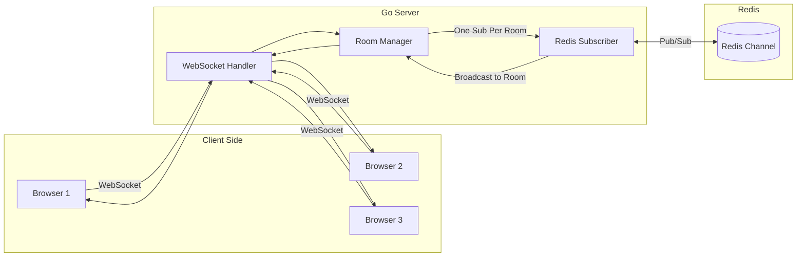
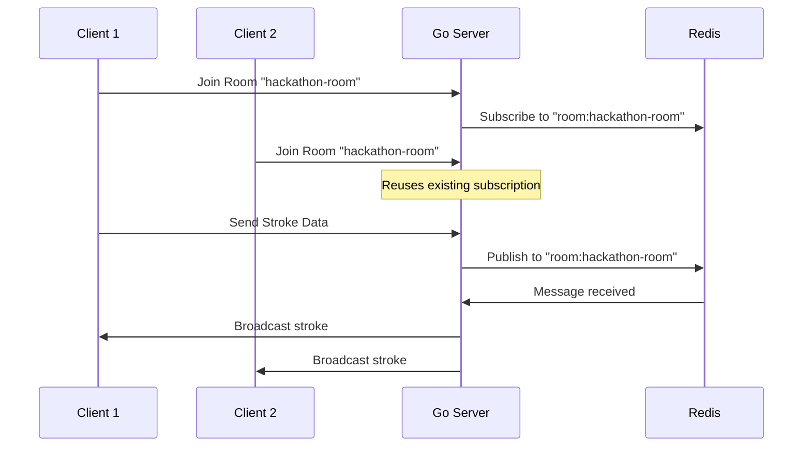
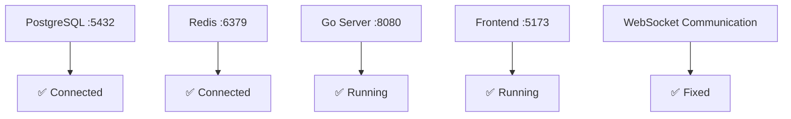

# WebSocket Communication Fix

## Problem Identified
- **Go WebSocket server not handling multiple clients properly**
- **Redis subscription goroutine leak** - new subscription created per client join
- **No room-based client management** - clients isolated from each other
- **Memory leaks** from unclosed Redis subscriptions

## Root Cause

## Solution Implemented

### Server Structure Changes
- **Added room management maps** to track clients by room
- **Single Redis subscription per room** instead of per client
- **Proper cleanup** when clients disconnect

### Code Changes Made
- `Server struct`: Added `rooms` and `roomSubscriptions` fields
- `handleJoin()`: Check if room subscription exists before creating
- `subscribeToRoom()`: Use room-specific subscription management
- `handleWebSocket()`: Clean up room data on client disconnect

## Fixed Architecture

## Message Flow

## Key Fixes
- **Memory leak fixed** - subscriptions properly cleaned up
- **Single subscription per room** - eliminates duplicate processing  
- **Room-based broadcasting** - messages only go to correct clients
- **Connection tracking** - server knows which clients are in which rooms

## Testing Results
- ✅ Multiple browser tabs now sync in real-time
- ✅ Go server running on port 8080
- ✅ Frontend connects successfully 
- ✅ Redis pub/sub working correctly
- ✅ No goroutine leaks

## Services Status

## Files Modified
- `go-server/main.go` - Server struct, room management, subscription handling
- Server initialization - Added room and subscription maps

The WebSocket communication between multiple clients is now working correctly with proper resource management.