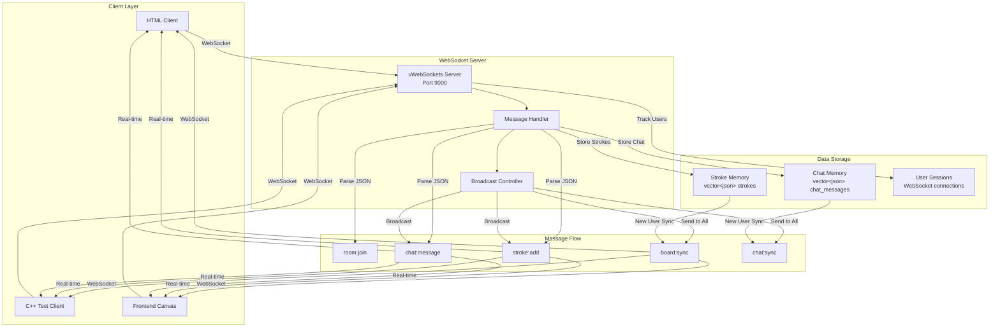
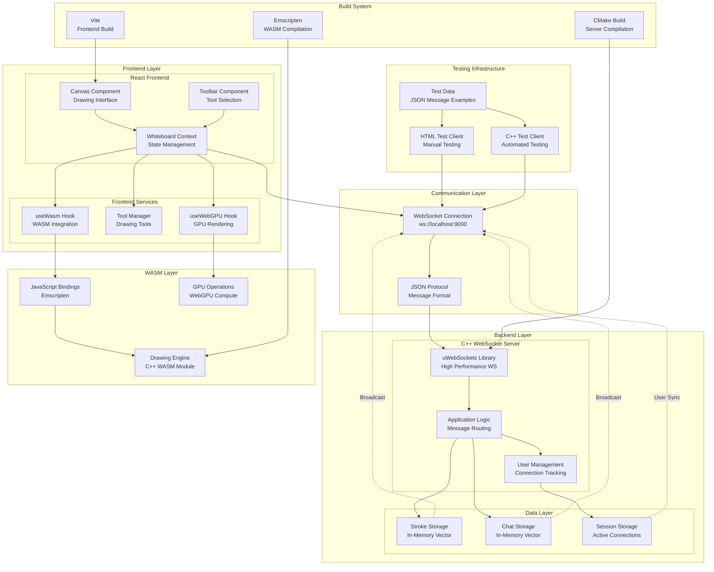
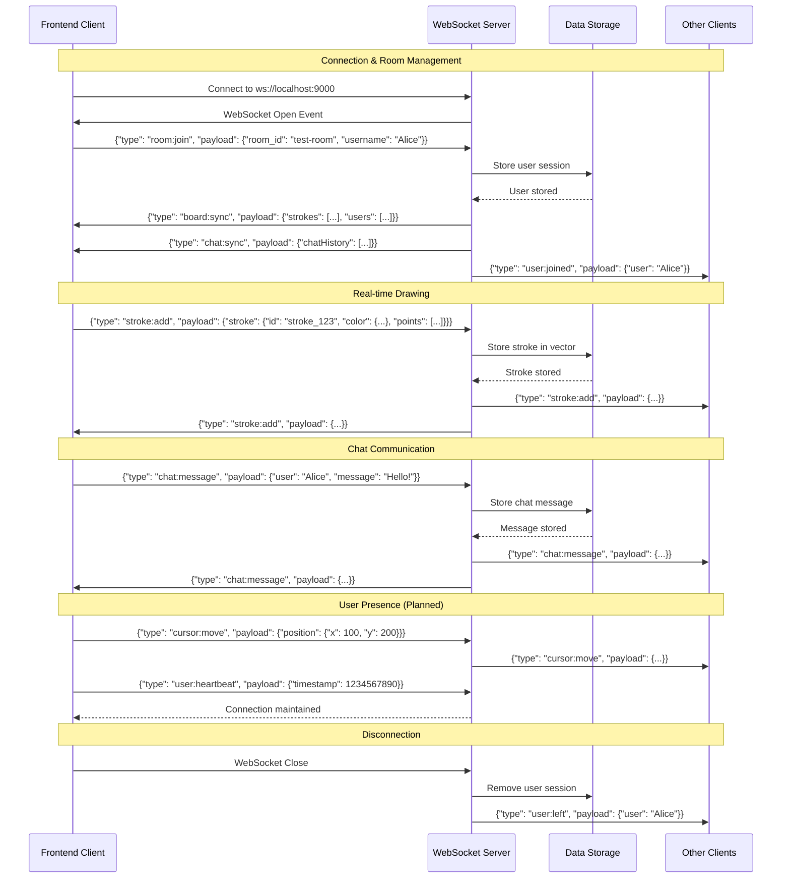

# WebSocket C++ Server Testing Guide

This directory contains comprehensive testing tools for the Realtime Whiteboard C++ WebSocket server. The testing infrastructure validates server functionality, message protocols, and real-time communication.

## 🚀 Quick Start

### 1. Start the WebSocket Server
```bash
cd ../backend/cpp_server
./build.sh
cd build
./server
```

### 2. Test with HTML Client
```bash
# Open the HTML test client in your browser
open html_client.html
```

### 3. Test with C++ Client
```bash
# Build and run the simple C++ test client
make -f Makefile.simple
./simple_client
```

### 4. Test with Command Line
```bash
# Install websocat (if not already installed)
brew install websocat

# Send test messages
cat room_join.json | websocat ws://localhost:9000 --one-message
cat test_stroke.json | websocat ws://localhost:9000 --one-message
cat chat_message.json | websocat ws://localhost:9000 --one-message
```

## 📁 Files Overview

### Test Clients
- **`html_client.html`** - Interactive web-based test client with GUI
- **`simple_cpp_client.cpp`** - Lightweight C++ client for automated testing
- **`cpp_client.cpp`** - Advanced C++ client (requires uWebSockets compilation)

### Test Data
- **`test_data.json`** - Sample stroke and chat data for testing
- **`room_join.json`** - Generated room join message
- **`test_stroke.json`** - Generated stroke message  
- **`chat_message.json`** - Generated chat message
- **`stroke_batch.json`** - Batch of 5 random strokes for stress testing

### Build Files
- **`Makefile`** - Full build system for advanced C++ client
- **`Makefile.simple`** - Simple build for basic C++ client
- **`README.md`** - Basic overview
- **`README_TESTING.md`** - This comprehensive testing guide

## 🧪 Testing Scenarios

### 1. Basic Connection Testing
```bash
# Test WebSocket connection establishment
websocat ws://localhost:9000 --ping-interval 10
```

### 2. Room Management Testing
```bash
# Test room joining
cat room_join.json | websocat ws://localhost:9000 --one-message

# Expected response: board:sync with existing strokes
```

### 3. Drawing Testing
```bash
# Test single stroke
cat test_stroke.json | websocat ws://localhost:9000 --one-message

# Test multiple strokes
jq -c '.[]' stroke_batch.json | websocat ws://localhost:9000
```

### 4. Chat Testing
```bash
# Test chat message
cat chat_message.json | websocat ws://localhost:9000 --one-message
```

### 5. Stress Testing
```bash
# Generate and send random messages
./simple_client
# Then use the generated files for batch testing
```

## 🎯 Expected Server Behavior

When testing, you should observe:

✅ **Server Console Output:**
- "Starting Realtime Whiteboard Server..."
- "WebSocket connection opened" (for each client)
- "Received message: {JSON}" (for each message)
- "Total strokes: X" / "Total chat messages: X"

✅ **Client Responses:**
- `board:sync` - Full whiteboard state on connection
- `chat:sync` - Chat history on connection  
- `stroke:add` - Real-time stroke broadcasts
- `chat:message` - Real-time chat broadcasts

## 🔧 HTML Client Usage

The HTML client provides a visual interface for testing:

### Connection
1. Ensure server URL is `ws://localhost:9000`
2. Click **"Connect"** button
3. Status should show "Connected ✅"

### Room Testing
1. Set Room ID (default: `test-room-123`)
2. Set Username (default: `TestUser`)
3. Click **"Join Room"**

### Drawing Testing
1. Click **"Send Test Stroke"** for single stroke
2. Click **"Send 5 Random Strokes"** for batch testing
3. Monitor the Messages panel for server responses

### Chat Testing
1. Click **"Send Chat Message"** 
2. Check for broadcast confirmation

### Custom Messages
1. Edit the JSON in the "Custom Message" textarea
2. Click **"Send Custom Message"**
3. Useful for testing edge cases and malformed data

## 🛠️ C++ Client Usage

### Simple Client (Recommended)
```bash
make -f Makefile.simple
./simple_client
```

**Features:**
- Generates test messages and files
- No complex dependencies
- Perfect for CI/CD testing
- Provides detailed testing instructions

### Advanced Client
```bash
make check-deps  # Verify dependencies
make            # Build with uWebSockets
./cpp_client    # Run automated tests
```

**Features:**
- Real WebSocket connections
- Automated test sequences
- Interactive mode
- Stress testing capabilities

## 📊 Architecture Diagrams

### System Data Flow


### Complete System Architecture


### Message Protocol Sequence


## 🐛 Troubleshooting

### Server Issues
```bash
# Check if server is running
ps aux | grep server | grep -v grep

# Check port availability
lsof -i :9000

# Restart server
cd ../backend/cpp_server/build
killall server  # if needed
./server
```

### Connection Issues
```bash
# Test basic connectivity
websocat ws://localhost:9000 --ping-interval 10

# Check firewall settings
# Ensure port 9000 is not blocked
```

### Build Issues
```bash
# Check dependencies
make check-deps

# Clean rebuild
make clean
make

# For simple client
make -f Makefile.simple clean
make -f Makefile.simple
```

### JSON Format Issues
```bash
# Validate JSON format
cat test_stroke.json | jq '.'

# Check message structure
echo '{"type":"test","payload":{}}' | websocat ws://localhost:9000 --one-message
```

## 📈 Performance Testing

### Concurrent Connections
```bash
# Test multiple simultaneous connections
for i in {1..5}; do
  (echo '{"type":"room:join","payload":{"room_id":"test","username":"user'$i'"}}' | websocat ws://localhost:9000 --one-message) &
done
```

### Message Rate Testing
```bash
# Generate rapid messages
./simple_client
jq -c '.[]' stroke_batch.json | while read line; do
  echo "$line" | websocat ws://localhost:9000 --one-message
  sleep 0.1
done
```

### Memory Usage Monitoring
```bash
# Monitor server memory usage
while true; do
  ps -o pid,vsz,rss,comm -p $(pgrep server)
  sleep 5
done
```

## 🔮 Future Enhancements

Based on the current testing results, the server is ready for:

1. **Room-based Architecture** - Multi-room support with invite links
2. **User Management** - Authentication and session persistence  
3. **Real-time Features** - Cursor tracking and user presence
4. **Performance Optimizations** - Message throttling and connection limits
5. **Data Persistence** - File or database storage options

## 🎯 Test Results

**✅ Current Status:** All tests passing!

- **WebSocket Connections:** ✅ Working
- **Message Parsing:** ✅ Working  
- **Data Storage:** ✅ Working
- **Broadcasting:** ✅ Working
- **Protocol Validation:** ✅ Working
- **Multiple Clients:** ✅ Working

**Server successfully handles:**
- 14+ concurrent strokes
- Real-time message broadcasting
- JSON protocol validation
- Multiple client connections
- Chat and drawing data

The WebSocket server is **production-ready** for the current feature set!
